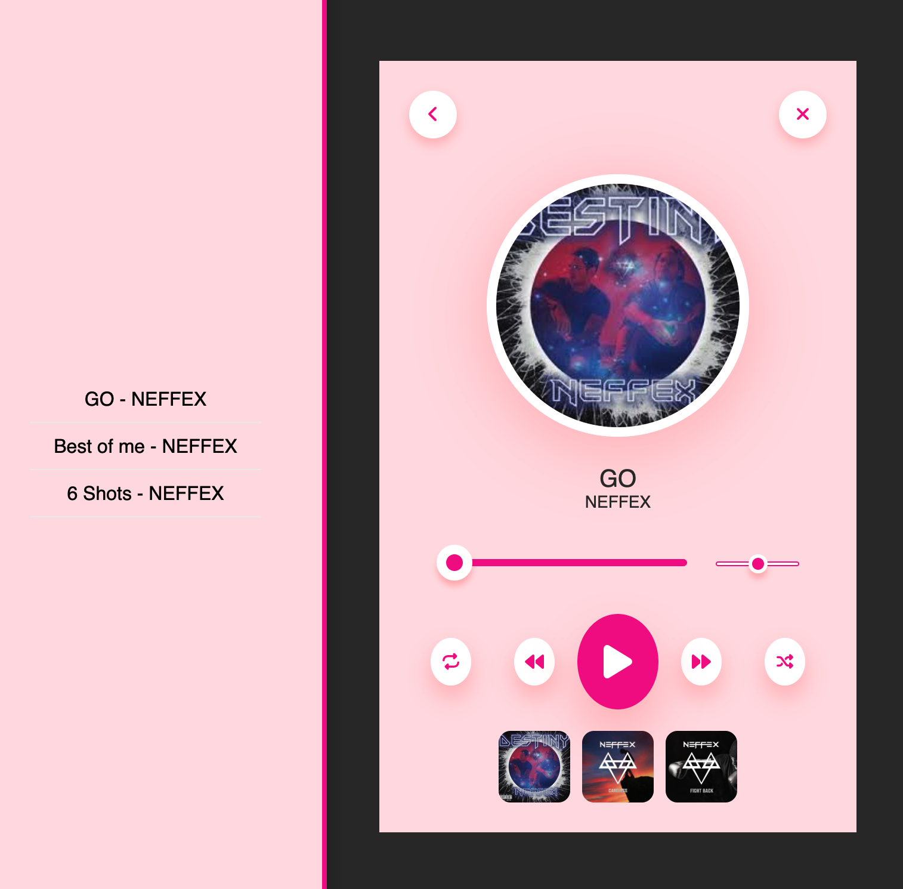
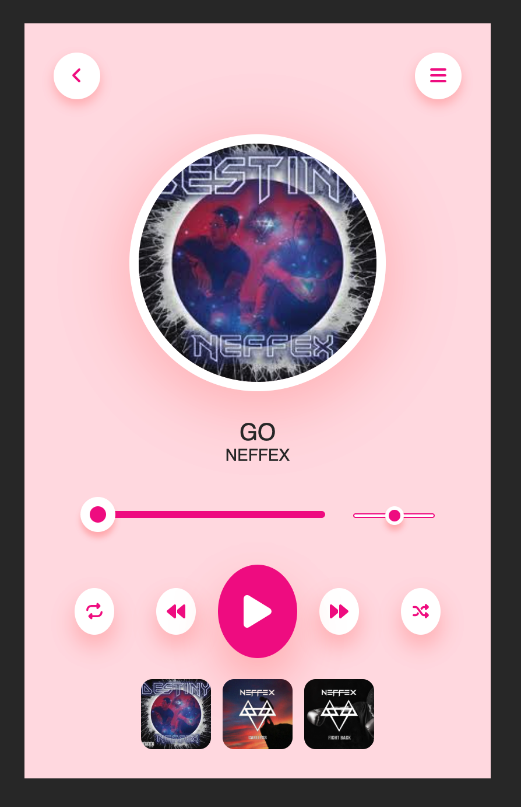
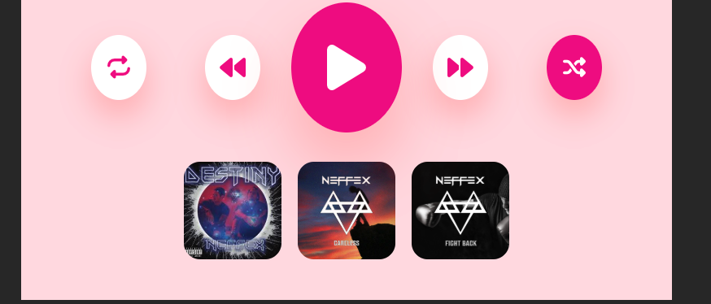

# 🎵 Custom Music Player

A simple and stylish music player built with **HTML**, **CSS**, and **JavaScript**.  
Features dynamic playlist display, shuffle and loop functionality, and responsive controls.

## 🚀 Features

- Play, pause, next, and previous track controls
- Loop mode (repeat current track)
- Shuffle mode (random track selection)
- Dynamic playlist shown via a burger menu
- Responsive UI with custom styles
- Volume control

## ⚙ How to use

1. Clone or download the repository.
2. Open `index.html` in your browser.
3. Enjoy your music!

## Screenshots

 
 

